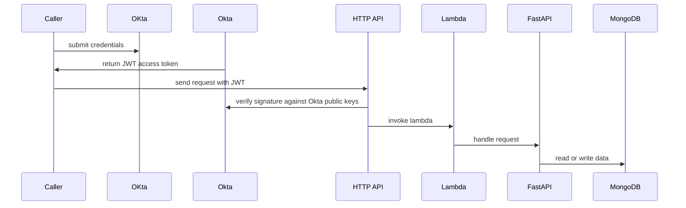

```mermaid
sequenceDiagram
Caller->>OKta: submit credentials
Okta->>Caller: return JWT access token
Caller->>HTTP API: send request with JWT
HTTP API->>Okta: verify signature against Okta public keys
HTTP API->>Lambda: invoke lambda
Lambda->>FastAPI: handle request
FastAPI->>MongoDB: read or write data
```
