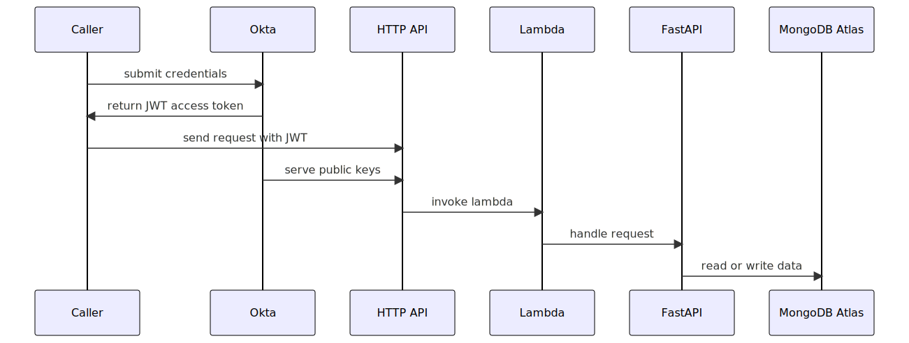

# FastAPI on AWS with MongoDB Atlas and Okta

## Objective
After going through this tutorial series you'll have a better understanding of how to create backend python endpoints that
read and write to [MongoDB Atlas][mongodb-atlas] and are secured behind [Okta][okta].

## Background
[FastAPI][fastapi] is a modern high-performance web framework for building backend API endpoints with Python. The usage of
type hints and [pydantic][pydantic] for request validation makes the code much cleaner than writing custom validation logic.
And it allows the framework to generate OpenAPI docs, which makes the endpoints easy for engineers to manually test and
integrate against.

## Architecture
We'll be deploying the backend endpoints to AWS API Gateway and Lambda, which gives us a common type of serverless architecture
that's relatively easy to get started with and should have little to no cost at 20 api requests per minute. There are two
main types of endpoints under API Gateway, REST and HTTP. We'll be using HTTP since it features builtin support for JWT
authorization. That's crucial to prevent the lambda function from being invoked by bots or bad actors. In order to
actually run the FastAPI code within the lambda function, we'll leverage a python library called [mangum][mangum]. This 
library provides an adapter to run FastAPI or other [ASGI][asgi] frameworks like [Quart][quart] or [Django][django] within
AWS Lambda, and besides API Gateway it supports integrations like Application Load Balancer (ALB) and CloudFront
Lambda@Edge. [Part 3][part-3] of the tutorial walks through the deployment details after you have the MongoDB and Okta code
integrations working locally.

## Codebase
You can browse the code used throughout this tutorial more in depth on GitHub:
https://github.com/rkhullar/example-webapp

## Tutorial
- [Part 1: Platforms and Resource Preparation][part-1]
- [Part 2: Project Setup and Local Development][part-2]
- [Part 3: Deployment][part-3]

[fastpi]: https://fastapi.tiangolo.com
[mongodb-atlas]: https://www.mongodb.com/atlas
[okta]: https://developer.okta.com
[pydantic]: https://docs.pydantic.dev/latest
[mangum]: https://pypi.org/project/mangum
[asgi]: https://asgi.readthedocs.io/en/latest
[django]: https://www.djangoproject.com/start/overview
[quart]: https://github.com/pallets/quart
[flask]: https://flask.palletsprojects.com

[overview]: https://medium.com/@rkhullar03/fastapi-on-aws-with-mongodb-atlas-and-okta-6e37c1d9069
[part-1]: https://medium.com/@rkhullar03/fastapi-on-aws-with-mongodb-atlas-and-okta-part-1-49179c987c9
[part-2]: https://medium.com/@rkhullar03/fastapi-on-aws-with-mongodb-atlas-and-okta-part-2-9e3fde8c89f6
[part-3]: https://medium.com/@rkhullar03/fastapi-on-aws-with-mongodb-atlas-and-okta-part-3-2f25db59fe6c
